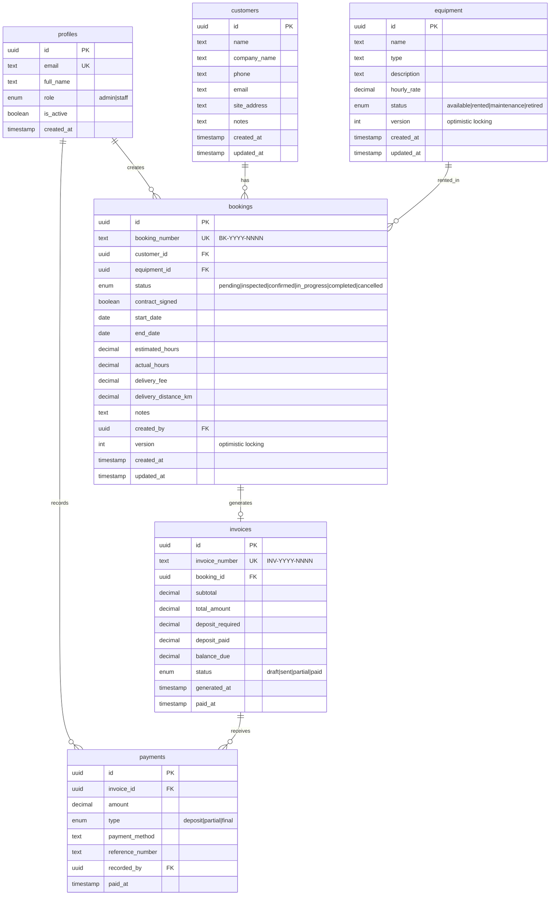
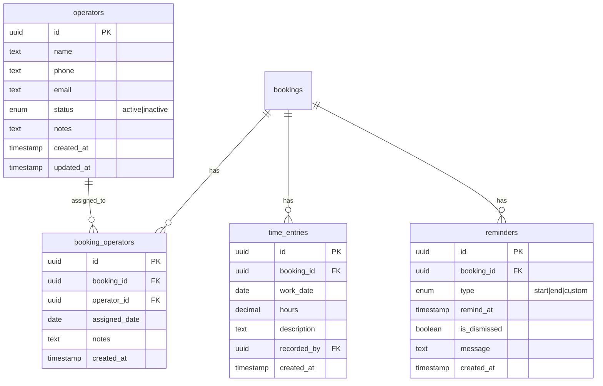

# Shine Ford - Heavy Equipment Rental Booking System

## Overview

Build a web-based internal booking system for a heavy equipment rental business to replace manual processes (Google Docs, Sheets, Drive) with a centralized application.

**Target Users:** 2 admins + 4 staff (6 total, internal only, desktop)
**Tech Stack:** Nuxt 3 + Supabase + Ant Design Vue + Tailwind CSS + AWS Amplify

### Timeline Summary

| Phase | Scope | Duration | Effort |
|-------|-------|----------|--------|
| **Phase 1: MVP** | Core booking system | 27 days | 216 hrs |
| **Phase 2: Enhancements** | Calendar, reports, operators | 17 days | 136 hrs |
| **Total** | | **44 days** | **352 hrs** |

*Timeline assumes 1 developer working 4-6 hours/day, 5 days/week (~9-11 weeks total)*

---

## Visual Timeline

```
PHASE 1: MVP (27 days)
═══════════════════════════════════════════════════════════════════════════════
Week 1      │ Week 2      │ Week 3      │ Week 4      │ Week 5      │ Week 6
────────────┼─────────────┼─────────────┼─────────────┼─────────────┼───────────
Setup       │ Auth        │ Customers   │ Bookings    │ Invoicing   │ Layout
Database    │ Equipment   │             │             │ Payments    │ Testing
            │             │             │             │             │ Deploy
═══════════════════════════════════════════════════════════════════════════════

PHASE 2: ENHANCEMENTS (17 days)
═══════════════════════════════════════════════════════════════════════════════
Week 7      │ Week 8      │ Week 9
────────────┼─────────────┼─────────────
Calendar    │ Operators   │ Reports
Time Track  │ Delivery    │ Testing
            │ Reminders   │ Deploy
═══════════════════════════════════════════════════════════════════════════════
```

### Detailed Phase Breakdown

**Phase 1: MVP (Days 1-27)**

| Module | Days | Tasks |
|--------|------|-------|
| 1.1 Project Setup | 1-2 | Nuxt 3, Supabase, Tailwind, Ant Design Vue, layout |
| 1.2 Database Schema | 3-4 | Tables, sequences, RLS policies, seed data |
| 2. Authentication | 5-6 | Login, session, role-based middleware |
| 3. Equipment | 7-9 | CRUD, status, rates, availability |
| 4. Customers | 10-11 | CRUD, contact info, site address |
| 5. Bookings | 12-15 | CRUD, workflow, availability check, status transitions |
| 6. Invoicing | 16-19 | Generation, PDF, line items, calculations |
| 7. Payments | 20-21 | Deposit tracking, partial payments, balance |
| 8. Layout & Nav | 22-23 | Dashboard, sidebar, global search |
| 9. Testing | 24-26 | Manual testing, bug fixes, polish |
| 10. Deployment | 27 | AWS Amplify, production config |

**Phase 2: Enhancements (Days 28-44)**

| Module | Days | Tasks |
|--------|------|-------|
| 2.1 Calendar View | 28-30 | Month/week/day views, drag-and-drop |
| 2.2 Time Tracking | 31-32 | Time entries, actual vs estimated |
| 2.3 Operators | 33-34 | CRUD, assignment to bookings, schedule |
| 2.4 Delivery Calculator | 35-36 | Per-km rates, discounts, settings |
| 2.5 Reminders | 37-38 | Auto-reminders, bell notifications |
| 2.6 Reports | 39-42 | Revenue, utilization, PDF export |
| 2.7 Testing & Deploy | 43-44 | Testing, optimization, deployment |

## Problem Statement

The client operates a heavy equipment rental business with 20-30 pieces of equipment. Currently:
- Customer information scattered across Google Drive
- Bookings tracked in spreadsheets (no availability visibility)
- Invoices created manually in Google Docs
- Deposit tracking is manual and error-prone
- No audit trail for business operations

## Proposed Solution

A centralized booking management system with:
1. **Equipment Management** - CRUD, availability tracking, hourly rates
2. **Customer Database** - Centralized contact and site information
3. **Booking Workflow** - Status-driven lifecycle with contract handling
4. **Invoice Generation** - Auto-numbered, PDF/print capable
5. **Payment Tracking** - 70% deposit, partial payments, balance due
6. **Role-Based Access** - Admin (full) vs Staff (limited) permissions

---

## Technical Approach

### Architecture

```
┌─────────────────────────────────────────────────────────────────┐
│                        AWS Amplify                               │
│  ┌───────────────────────────────────────────────────────────┐  │
│  │                      Nuxt 3 (SSR)                          │  │
│  │  ┌─────────────┐  ┌─────────────┐  ┌─────────────────┐    │  │
│  │  │   Pages     │  │ Composables │  │   Components    │    │  │
│  │  │  (routing)  │  │ (data/logic)│  │  (Ant Design)   │    │  │
│  │  └─────────────┘  └─────────────┘  └─────────────────┘    │  │
│  │                           │                                │  │
│  │                    ┌──────▼──────┐                        │  │
│  │                    │  Supabase   │                        │  │
│  │                    │   Client    │                        │  │
│  │                    └──────┬──────┘                        │  │
│  └───────────────────────────┼───────────────────────────────┘  │
└──────────────────────────────┼──────────────────────────────────┘
                               │
                    ┌──────────▼──────────┐
                    │      Supabase       │
                    │  ┌───────────────┐  │
                    │  │  PostgreSQL   │  │
                    │  │  + RLS        │  │
                    │  └───────────────┘  │
                    │  ┌───────────────┐  │
                    │  │     Auth      │  │
                    │  └───────────────┘  │
                    └─────────────────────┘
```

### Database Schema (ERD)



### State Machine: Booking Status

```
                    ┌──────────────┐
                    │   PENDING    │ (equipment soft-reserved)
                    └──────┬───────┘
                           │ [site inspection completed]
                    ┌──────▼───────┐
                    │  INSPECTED   │
                    └──────┬───────┘
                           │ [70% deposit received + contract signed]
                    ┌──────▼───────┐
                    │  CONFIRMED   │ (equipment hard-reserved)
                    └──────┬───────┘
                           │ [equipment delivered to site]
                    ┌──────▼───────┐
                    │ IN_PROGRESS  │ (equipment status = rented)
                    └──────┬───────┘
                           │ [rental period ended + final invoice]
                    ┌──────▼───────┐
                    │  COMPLETED   │ (equipment status = available)
                    └──────────────┘

    Any status (except COMPLETED) ───────► CANCELLED
                                          (non-refundable)
```

**Transition Rules:**
| From | To | Guard Condition |
|------|----|-----------------|
| pending | inspected | Inspection date recorded |
| pending | cancelled | User action |
| inspected | confirmed | deposit_paid >= 70% of total AND contract_signed = true |
| inspected | cancelled | User action |
| confirmed | in_progress | Equipment delivered (manual status change) |
| confirmed | cancelled | Admin only, deposit forfeited |
| in_progress | completed | actual_hours recorded, final invoice generated |
| in_progress | cancelled | Admin only, prorated billing |

---

## Implementation Phases

### Phase 1: Foundation (Days 1-4)

#### 1.1 Project Setup (2 days)

**Files to create:**

```
nuxt.config.ts
tailwind.config.ts
.env.example
components/
  layout/
    AppLayout.vue
    Sidebar.vue
    Header.vue
layouts/
  default.vue
  auth.vue
middleware/
  auth.ts
types/
  database.types.ts
  index.ts
```

**Tasks:**
- [x] Initialize Nuxt 3 project with TypeScript
- [x] Install dependencies: `@nuxtjs/supabase`, `ant-design-vue`, `@nuxtjs/tailwindcss`, `pdfmake`
- [x] Configure Tailwind with Ant Design preflight disabled
- [x] Create base layout with sidebar navigation
- [x] Set up environment variables (.env.example)
- [x] Configure Supabase client

**Acceptance Criteria:**
- [x] `npm run dev` starts without errors
- [x] Ant Design Vue components render correctly
- [x] Tailwind utilities work alongside Ant Design
- [x] Supabase connection established

#### 1.2 Database Schema (2 days)

**Files to create:**

```
supabase/
  migrations/
    001_create_profiles.sql
    002_create_equipment.sql
    003_create_customers.sql
    004_create_bookings.sql
    005_create_invoices.sql
    006_create_payments.sql
    007_create_sequences.sql
    008_create_rls_policies.sql
  seed.sql
```

**Tasks:**
- [ ] Create all 6 tables with constraints and indexes
- [ ] Implement booking_number sequence (BK-YYYY-NNNN)
- [ ] Implement invoice_number sequence (INV-YYYY-NNNN)
- [ ] Add `version` column for optimistic locking on bookings/equipment
- [ ] Create RLS policies for all tables
- [ ] Generate TypeScript types from Supabase schema
- [ ] Create seed data (sample equipment, customers)

**RLS Policy Matrix:**

| Table | Admin | Staff |
|-------|-------|-------|
| profiles | CRUD own, Read all | Read all, Update own |
| equipment | CRUD all | Read all, Update status only |
| customers | CRUD all | CRUD all |
| bookings | CRUD all | Create, Read all, Update own |
| invoices | CRUD all | Create, Read all |
| payments | CRUD all | Create, Read all |

**Acceptance Criteria:**
- [ ] All tables created with proper constraints
- [ ] Sequences generate correct format (BK-2026-0001, INV-2026-0001)
- [ ] RLS policies block unauthorized access
- [ ] TypeScript types generated and importable

---

### Phase 2: Authentication (Days 5-6)

**Files to create:**

```
pages/
  login.vue
middleware/
  auth.ts
  admin.ts
composables/
  useAuth.ts
stores/
  auth.ts
```

**Tasks:**
- [ ] Create login page with email/password
- [ ] Implement auth middleware (redirect unauthenticated users)
- [ ] Create admin middleware (restrict admin-only routes)
- [ ] Build useAuth composable (login, logout, currentUser, isAdmin)
- [ ] Show user info in header with logout button
- [ ] Handle session persistence across page refreshes

**Acceptance Criteria:**
- [ ] Users can log in with valid credentials
- [ ] Invalid credentials show error message
- [ ] Unauthenticated users redirected to /login
- [ ] Staff users cannot access admin-only routes
- [ ] Session persists across browser refresh

---

### Phase 3: Equipment Module (Days 7-9)

**Files to create:**

```
pages/
  equipment/
    index.vue
    [id].vue
    new.vue
components/
  equipment/
    EquipmentTable.vue
    EquipmentForm.vue
    EquipmentStatusBadge.vue
composables/
  useEquipment.ts
```

**Tasks:**
- [ ] Create equipment list page with Ant Design Table
  - Columns: Name, Type, Hourly Rate, Status, Actions
  - Sortable columns, pagination (25/page)
  - Search by name/type
  - Filter by status dropdown
- [ ] Create equipment form (create/edit)
  - Fields: name*, type*, description, hourly_rate*, status
  - Validation: name required, hourly_rate > 0
  - Admin-only: rate editing
- [ ] Create equipment detail page
  - Show all fields
  - List related bookings
  - Edit/delete buttons (admin only for delete)
- [ ] Implement soft delete (status = retired)
- [ ] Block deletion if active bookings exist

**Acceptance Criteria:**
- [ ] List displays all equipment with correct pagination
- [ ] Search filters results as user types
- [ ] Status filter works correctly
- [ ] Form validates required fields
- [ ] Staff cannot modify hourly rates
- [ ] Cannot delete equipment with active bookings

---

### Phase 4: Customer Module (Days 10-11)

**Files to create:**

```
pages/
  customers/
    index.vue
    [id].vue
    new.vue
components/
  customers/
    CustomerTable.vue
    CustomerForm.vue
composables/
  useCustomers.ts
```

**Tasks:**
- [ ] Create customer list page
  - Columns: Name, Company, Phone, Email, Actions
  - Search by name/company/email
  - Pagination (25/page)
- [ ] Create customer form (create/edit)
  - Fields: name*, company_name, phone*, email*, site_address*, notes
  - Validation: email format, phone format
- [ ] Create customer detail page
  - Show all fields
  - List related bookings
  - Edit/delete buttons (admin only for delete)
- [ ] Block deletion if bookings exist

**Acceptance Criteria:**
- [ ] Customer list displays with search/pagination
- [ ] Form validates email and phone formats
- [ ] Cannot delete customer with existing bookings
- [ ] Site address captured for delivery

---

### Phase 5: Booking Module (Days 12-15)

**Files to create:**

```
pages/
  bookings/
    index.vue
    [id].vue
    new.vue
components/
  bookings/
    BookingTable.vue
    BookingForm.vue
    BookingStatusBadge.vue
    BookingStatusTransition.vue
    AvailabilityChecker.vue
composables/
  useBookings.ts
  useAvailability.ts
```

**Tasks:**
- [ ] Create booking list page
  - Columns: Booking #, Customer, Equipment, Dates, Status, Actions
  - Filter by status, date range
  - Search by booking number, customer name
- [ ] Create booking form
  - Customer selection (searchable dropdown)
  - Equipment selection with availability check
  - Date range picker (start_date, end_date)
  - Estimated hours input
  - Delivery fee and distance
  - Notes field
- [ ] Implement availability checking
  - Query bookings for same equipment overlapping dates
  - Exclude cancelled and completed bookings
  - Show warning if equipment unavailable
  - Use optimistic locking on save
- [ ] Create booking detail page
  - All booking information
  - Status workflow buttons (based on current status)
  - Contract signed checkbox
  - Link to invoice when generated
- [ ] Implement status transitions
  - Validate guard conditions before transition
  - Update equipment status when appropriate
  - Record who made the change

**Concurrency Handling:**

```sql
-- Optimistic locking on booking save
UPDATE bookings
SET status = 'confirmed', version = version + 1
WHERE id = $1 AND version = $2
RETURNING *;

-- If no rows returned, show conflict error
```

**Acceptance Criteria:**
- [ ] Availability check prevents double-booking
- [ ] Status transitions follow defined rules
- [ ] Contract must be signed before confirming
- [ ] Deposit must be recorded before confirming
- [ ] Concurrent booking attempts handled gracefully
- [ ] Equipment status updates on in_progress/completed

---

### Phase 6: Invoice Module (Days 16-19)

**Files to create:**

```
pages/
  invoices/
    index.vue
    [id].vue
components/
  invoices/
    InvoiceTable.vue
    InvoiceDetail.vue
    InvoicePDF.vue
    PaymentForm.vue
    PaymentList.vue
composables/
  useInvoices.ts
  usePayments.ts
  usePDF.ts
```

**Tasks:**
- [ ] Create invoice list page
  - Columns: Invoice #, Booking #, Customer, Amount, Status, Actions
  - Filter by status (draft, sent, partial, paid)
  - Search by invoice number
- [ ] Implement invoice generation from booking
  - Auto-generate invoice number (INV-YYYY-NNNN via sequence)
  - Calculate subtotal (hourly_rate × actual_hours)
  - Add delivery fee
  - Calculate 70% deposit required
  - Track deposit paid and balance due
- [ ] Create invoice detail page
  - Invoice header (number, date, customer)
  - Line items (equipment, hours, rate, delivery)
  - Payment summary (deposit, paid, balance)
  - Payment recording form
  - Print and PDF export buttons
- [ ] Implement PDF generation
  - Company header/logo placeholder
  - Invoice details and line items
  - Payment instructions
  - Print-friendly layout
- [ ] Create payment recording
  - Amount, type (deposit/partial/final), method, reference
  - Update invoice balance_due on save
  - Update invoice status based on payments

**Invoice Calculation:**

```typescript
interface InvoiceCalculation {
  equipmentHours: number;       // actual_hours from booking
  hourlyRate: number;           // from equipment
  deliveryFee: number;          // from booking
  subtotal: number;             // hours × rate
  totalAmount: number;          // subtotal + delivery
  depositRequired: number;      // total × 0.70
  depositPaid: number;          // sum of deposit payments
  balanceDue: number;           // total - all payments
}
```

**Acceptance Criteria:**
- [ ] Invoice numbers auto-increment correctly
- [ ] Calculations are accurate
- [ ] PDF generates with correct formatting
- [ ] Print dialog opens correctly
- [ ] Payment recording updates balance
- [ ] Invoice status updates based on payments

---

### Phase 7: Payment Tracking (Days 20-21)

**Tasks (continuation of invoice module):**
- [ ] Create payment history view on invoice
- [ ] Implement deposit tracking
  - Show deposit required (70%)
  - Show deposit paid
  - Show remaining deposit needed
- [ ] Track partial payments
- [ ] Mark invoice as paid when balance = 0
- [ ] Dashboard widget showing outstanding balances

**Acceptance Criteria:**
- [ ] Can record multiple payments per invoice
- [ ] Balance updates correctly after each payment
- [ ] Invoice status reflects payment state
- [ ] Dashboard shows total outstanding

---

### Phase 8: Layout & Navigation (Days 22-23)

**Files to update:**

```
components/
  layout/
    AppLayout.vue
    Sidebar.vue
    Header.vue
    GlobalSearch.vue
pages/
  index.vue (Dashboard)
```

**Tasks:**
- [ ] Finalize sidebar navigation
  - Dashboard, Equipment, Customers, Bookings, Invoices
  - Users (admin only)
  - Active route highlighting
- [ ] Create dashboard page
  - Recent bookings list
  - Pending actions (bookings needing attention)
  - Equipment availability summary
  - Outstanding invoices total
- [ ] Implement global search
  - Search across equipment, customers, bookings
  - Show results in dropdown
  - Navigate to detail on selection
- [ ] Polish responsive layout
  - Sidebar collapse on smaller screens
  - Table horizontal scroll on mobile

**Acceptance Criteria:**
- [ ] Navigation is intuitive
- [ ] Dashboard provides useful overview
- [ ] Global search finds relevant results
- [ ] Layout works on various screen sizes

---

### Phase 9: Testing & Polish (Days 24-26)

**Tasks:**
- [ ] Manual testing of all workflows
  - Complete booking lifecycle
  - All status transitions
  - Invoice generation and payment
  - Permission restrictions
- [ ] Fix discovered bugs
- [ ] Add loading states to all data fetches
- [ ] Add error messages for API failures
- [ ] Add confirmation dialogs for destructive actions
- [ ] Optimize slow queries (add indexes if needed)

**Test Scenarios:**
- [ ] Create booking → inspect → confirm → complete
- [ ] Concurrent booking attempt (two users)
- [ ] Staff tries admin action (should fail)
- [ ] Invoice with multiple payments
- [ ] Cancel booking at various stages

---

### Phase 10: Deployment (Day 27)

**Tasks:**
- [ ] Configure AWS Amplify project
- [ ] Set environment variables in Amplify
- [ ] Deploy to staging environment
- [ ] Test all functionality on staging
- [ ] Configure custom domain (if available)
- [ ] Create production Supabase project
- [ ] Run migrations on production
- [ ] Deploy to production
- [ ] Verify all functionality
- [ ] Create initial admin user

**Environment Variables:**
```
NUXT_PUBLIC_SUPABASE_URL=
NUXT_PUBLIC_SUPABASE_KEY=
SUPABASE_SERVICE_KEY= (server-only)
```

**Acceptance Criteria:**
- [ ] Application accessible via URL
- [ ] HTTPS enabled
- [ ] All features working in production
- [ ] Initial admin can log in

---

## Success Metrics

| Metric | Target |
|--------|--------|
| Replace spreadsheets | All bookings managed in system |
| Centralized customer data | Single source of truth |
| Automated invoicing | Generate from booking in <1 minute |
| Equipment visibility | See availability at a glance |
| Deposit tracking | Clear view of payments and balances |

---

## Risks & Mitigations

| Risk | Impact | Mitigation |
|------|--------|------------|
| Double-booking | Customer dissatisfaction | Optimistic locking + availability check |
| Data migration | Loss of historical data | Import script + validation before go-live |
| User adoption | System unused | Simple UI, training session, documentation |
| Supabase limits | Service interruption | Monitor usage, upgrade path ready ($25/mo) |
| PDF generation | Browser compatibility | Test on target browsers, server-side fallback |

---

---

# PHASE 2: ENHANCEMENTS (Days 28-44)

## Overview

Phase 2 adds operational enhancements after MVP is stable:
- Visual calendar for booking management
- Time tracking (actual vs estimated hours)
- Operator assignment to bookings
- Delivery calculator with per-km rates
- In-system reminders
- Revenue and utilization reports

**Prerequisites:** Phase 1 MVP deployed and stable

---

## Phase 2 Database Changes

### New Tables



### Schema Migrations

**Files to create:**

```
supabase/migrations/
  009_create_operators.sql
  010_create_booking_operators.sql
  011_create_time_entries.sql
  012_create_reminders.sql
  013_add_delivery_rate_to_equipment.sql
```

---

## Phase 2.1: Calendar View (Days 28-30)

**Files to create:**

```
pages/
  calendar/
    index.vue
components/
  calendar/
    BookingCalendar.vue
    CalendarDayView.vue
    CalendarWeekView.vue
    CalendarMonthView.vue
    CalendarBookingCard.vue
composables/
  useCalendar.ts
```

**Tasks:**
- [ ] Install calendar library (FullCalendar Vue or custom with Ant Design)
- [ ] Create calendar page with month/week/day views
- [ ] Display bookings as colored blocks by status
  - Pending: Yellow
  - Confirmed: Blue
  - In Progress: Green
  - Completed: Gray
  - Cancelled: Red (strikethrough)
- [ ] Click booking to open detail modal
- [ ] Drag-and-drop to reschedule (if equipment available)
- [ ] Filter by equipment type or specific equipment
- [ ] Filter by customer
- [ ] Show equipment name on booking block

**Calendar Features:**

```typescript
interface CalendarBooking {
  id: string;
  title: string;           // Equipment name
  start: Date;             // start_date
  end: Date;               // end_date
  backgroundColor: string; // based on status
  extendedProps: {
    bookingNumber: string;
    customerName: string;
    status: BookingStatus;
    equipmentId: string;
  };
}
```

**Acceptance Criteria:**
- [ ] Calendar displays all non-cancelled bookings
- [ ] Can switch between month/week/day views
- [ ] Clicking booking opens detail modal
- [ ] Drag-and-drop checks availability before moving
- [ ] Equipment filter works correctly
- [ ] Today is highlighted

---

## Phase 2.2: Time Tracking (Days 31-32)

**Files to create:**

```
pages/
  bookings/
    [id]/
      time.vue
components/
  time/
    TimeEntryTable.vue
    TimeEntryForm.vue
    TimeComparisonCard.vue
composables/
  useTimeEntries.ts
```

**Tasks:**
- [ ] Add time entries section to booking detail
- [ ] Create time entry form
  - Work date (required)
  - Hours worked (required, 0.5 increments)
  - Description (optional)
- [ ] Display time entries table on booking
  - Columns: Date, Hours, Description, Recorded By, Actions
  - Sort by date descending
- [ ] Show comparison card
  - Estimated hours (from booking)
  - Actual hours (sum of time entries)
  - Variance (actual - estimated)
  - Variance percentage
- [ ] Auto-populate actual_hours on booking from sum
- [ ] Prevent time entry on completed/cancelled bookings

**Time Tracking UI:**

```
┌─────────────────────────────────────────────────────┐
│ Time Tracking                           [+ Add Entry]│
├─────────────────────────────────────────────────────┤
│ Estimated: 40 hrs │ Actual: 38 hrs │ Variance: -2 hrs│
├─────────────────────────────────────────────────────┤
│ Date       │ Hours │ Description        │ Actions   │
│ 2026-03-20 │ 8.0   │ Site preparation   │ Edit Del  │
│ 2026-03-21 │ 8.0   │ Excavation work    │ Edit Del  │
│ 2026-03-22 │ 6.0   │ Final day          │ Edit Del  │
└─────────────────────────────────────────────────────┘
```

**Acceptance Criteria:**
- [ ] Can add time entries to active bookings
- [ ] Actual hours updates automatically
- [ ] Variance shows correctly
- [ ] Cannot add time to completed bookings
- [ ] Time entries appear in invoice calculation

---

## Phase 2.3: Operator Assignment (Days 33-34)

**Files to create:**

```
pages/
  operators/
    index.vue
    [id].vue
    new.vue
components/
  operators/
    OperatorTable.vue
    OperatorForm.vue
    OperatorAssignment.vue
    OperatorSchedule.vue
composables/
  useOperators.ts
```

**Tasks:**
- [ ] Create operators CRUD pages
  - List with search and status filter
  - Add/edit form (name, phone, email, status)
  - Detail page with assignment history
- [ ] Add operator assignment to booking
  - Multi-select operators for booking
  - Assign dates within booking period
  - Notes per assignment
- [ ] Show operator schedule view
  - Calendar showing operator assignments
  - Avoid double-booking operators
- [ ] Add operator section to booking detail
  - List assigned operators
  - Add/remove assignments
- [ ] Admin only: manage operators
- [ ] Staff: view operators, assign to bookings

**Operator Assignment UI:**

```
┌─────────────────────────────────────────────────────┐
│ Assigned Operators                    [+ Assign]    │
├─────────────────────────────────────────────────────┤
│ Operator      │ Dates           │ Notes    │ Actions│
│ John Smith    │ Mar 20-22       │ Lead     │ Remove │
│ Mike Johnson  │ Mar 20-21       │ Assist   │ Remove │
└─────────────────────────────────────────────────────┘
```

**Acceptance Criteria:**
- [ ] CRUD operations for operators work
- [ ] Can assign multiple operators to booking
- [ ] Operator calendar shows all assignments
- [ ] Warning if operator already assigned on same dates
- [ ] Inactive operators cannot be assigned

---

## Phase 2.4: Delivery Calculator (Days 35-36)

**Files to create:**

```
components/
  delivery/
    DeliveryCalculator.vue
    DeliveryRateSettings.vue
composables/
  useDeliveryCalculator.ts
```

**Tasks:**
- [ ] Add delivery rate settings (admin only)
  - Base rate per km
  - Minimum delivery fee
  - Discount thresholds (e.g., 10% off for >50km)
- [ ] Create delivery calculator component
  - Distance input (km)
  - Auto-calculate fee based on rate
  - Show discount if applicable
  - Manual override option
- [ ] Integrate into booking form
  - Replace simple delivery_fee input
  - Store both distance and calculated fee
- [ ] Show breakdown in invoice
  - Distance: X km
  - Rate: $Y/km
  - Discount: Z%
  - Delivery Fee: $Total

**Delivery Calculation:**

```typescript
interface DeliveryRate {
  ratePerKm: number;      // e.g., 5.00
  minimumFee: number;     // e.g., 50.00
  discountThresholds: {
    distance: number;     // e.g., 50
    discountPercent: number; // e.g., 10
  }[];
}

function calculateDeliveryFee(distance: number, rates: DeliveryRate): number {
  let fee = Math.max(distance * rates.ratePerKm, rates.minimumFee);

  // Apply highest applicable discount
  for (const threshold of rates.discountThresholds) {
    if (distance >= threshold.distance) {
      fee = fee * (1 - threshold.discountPercent / 100);
    }
  }

  return fee;
}
```

**Acceptance Criteria:**
- [ ] Delivery rates configurable by admin
- [ ] Calculator shows real-time fee as distance entered
- [ ] Discounts apply automatically
- [ ] Manual override available
- [ ] Invoice shows delivery breakdown

---

## Phase 2.5: In-System Reminders (Days 37-38)

**Files to create:**

```
components/
  reminders/
    ReminderBell.vue
    ReminderList.vue
    ReminderForm.vue
composables/
  useReminders.ts
```

**Tasks:**
- [ ] Create reminder system
  - Auto-create reminders for booking start (1 day before)
  - Auto-create reminders for booking end (1 day before)
  - Custom reminders (manual)
- [ ] Add reminder bell to header
  - Show count of active reminders
  - Click to open dropdown list
  - Mark as dismissed
- [ ] Show reminders on dashboard
  - Today's reminders section
  - Upcoming reminders (next 7 days)
- [ ] Add reminder management to booking detail
  - List existing reminders
  - Add custom reminder
  - Delete reminders
- [ ] Reminders query on page load (polling or realtime)

**Reminder UI:**

```
┌──────────────────────────────┐
│ 🔔 (3)                       │  ← Header bell with count
├──────────────────────────────┤
│ Today                        │
│ • Booking BK-2026-0042 starts│
│   tomorrow (Excavator XL)    │
│ • Booking BK-2026-0038 ends  │
│   today (Loader M)           │
├──────────────────────────────┤
│ Upcoming                     │
│ • Mar 27: BK-2026-0045 start │
└──────────────────────────────┘
```

**Acceptance Criteria:**
- [ ] Auto-reminders created for new bookings
- [ ] Bell shows unread count
- [ ] Dismissing removes from list
- [ ] Dashboard shows today's reminders
- [ ] Custom reminders can be created

---

## Phase 2.6: Reports (Days 39-42)

**Files to create:**

```
pages/
  reports/
    index.vue
    revenue.vue
    utilization.vue
components/
  reports/
    ReportFilters.vue
    RevenueChart.vue
    UtilizationChart.vue
    ReportTable.vue
    ReportPDF.vue
composables/
  useReports.ts
  useReportPDF.ts
```

**Tasks:**
- [ ] Create reports landing page with links
- [ ] Revenue Report
  - Date range filter
  - Group by: day/week/month
  - Filter by equipment type
  - Total revenue chart (bar/line)
  - Revenue breakdown table
  - Comparison to previous period
- [ ] Utilization Report
  - Date range filter
  - Equipment utilization % (rented days / available days)
  - Most/least utilized equipment
  - Utilization heatmap by equipment
- [ ] PDF Export for both reports
  - Company header
  - Report title and date range
  - Charts as images
  - Data tables
- [ ] Admin and staff can access

**Revenue Report:**

```
┌─────────────────────────────────────────────────────┐
│ Revenue Report                                       │
│ Period: Mar 1-31, 2026            [Export PDF]      │
├─────────────────────────────────────────────────────┤
│ [Bar Chart: Daily/Weekly Revenue]                   │
├─────────────────────────────────────────────────────┤
│ Summary                                              │
│ Total Revenue: $45,230                              │
│ vs Previous Period: +12% ($5,120)                   │
│ Bookings: 28                                        │
│ Avg Revenue per Booking: $1,615                     │
├─────────────────────────────────────────────────────┤
│ By Equipment Type                                    │
│ Excavators: $22,500 (50%)                           │
│ Loaders: $15,200 (33%)                              │
│ Cranes: $7,530 (17%)                                │
└─────────────────────────────────────────────────────┘
```

**Utilization Report:**

```
┌─────────────────────────────────────────────────────┐
│ Equipment Utilization Report                         │
│ Period: Mar 1-31, 2026            [Export PDF]      │
├─────────────────────────────────────────────────────┤
│ Overall Utilization: 68%                            │
├─────────────────────────────────────────────────────┤
│ Equipment        │ Days Rented │ Available │ Util % │
│ Excavator XL     │ 25          │ 31        │ 81%    │
│ Loader Medium    │ 22          │ 31        │ 71%    │
│ Crane 50T        │ 18          │ 31        │ 58%    │
│ Mini Excavator   │ 12          │ 31        │ 39%    │
└─────────────────────────────────────────────────────┘
```

**Acceptance Criteria:**
- [ ] Revenue report shows accurate totals
- [ ] Charts render correctly
- [ ] Date range filter works
- [ ] Utilization calculates correctly
- [ ] PDF exports with proper formatting
- [ ] Period comparison shows variance

---

## Phase 2.7: Testing & Polish (Days 43-44)

**Tasks:**
- [ ] Test all Phase 2 features end-to-end
  - Calendar navigation and drag-drop
  - Time entry workflow
  - Operator assignment flow
  - Delivery calculator accuracy
  - Reminder system
  - Report generation
- [ ] Fix discovered bugs
- [ ] Performance optimization
  - Calendar query optimization
  - Report query optimization (indexes)
- [ ] Update user documentation
- [ ] Deploy Phase 2 to production

**Test Scenarios:**
- [ ] View bookings on calendar, drag to reschedule
- [ ] Add time entries, verify invoice updates
- [ ] Assign operators, check schedule conflicts
- [ ] Calculate delivery fee with discounts
- [ ] Verify reminder notifications appear
- [ ] Generate revenue report for date range
- [ ] Export utilization report to PDF

---

## Phase 2 Success Metrics

| Metric | Target |
|--------|--------|
| Calendar adoption | Staff use calendar view for planning |
| Time tracking accuracy | Actual hours within 10% of estimated |
| Operator visibility | All assignments visible in schedule |
| Report usage | Admin generates weekly revenue report |

---

## Out of Scope (Phase 3 / Future)

- Seasonal rate management
- Contract templates with PDF generation
- Dashboard with KPIs
- Audit logs
- Email/SMS notifications
- Customer self-service portal
- Mobile application
- Accounting integration

---

## References

### Internal
- [Requirements](/docs/requirements.md)
- [Technical Specification](/docs/technical-specification.md)
- [Brainstorm](/docs/brainstorms/2026-03-25-heavy-equipment-rental-system-brainstorm.md)

### External
- [Nuxt 3 Documentation](https://nuxt.com/docs)
- [Supabase Documentation](https://supabase.com/docs)
- [Ant Design Vue](https://antdv.com/docs/vue/introduce)
- [pdfmake Documentation](https://pdfmake.github.io/docs/)
- [FullCalendar Vue 3](https://fullcalendar.io/docs/vue) (for Phase 2 calendar)

---

## Critical Implementation Notes

### From SpecFlow Analysis

**Address these gaps during implementation:**

1. **Concurrency** - Use optimistic locking (version field) on bookings and equipment tables
2. **Soft reservation** - "Pending" status reserves equipment; set 48-hour expiration if not progressed
3. **Sequence collision** - Use Postgres SEQUENCE for booking/invoice numbers (not app logic)
4. **Date validation** - start_date >= today, end_date > start_date, no overlap with existing bookings
5. **Equipment integrity** - Block delete/retire if active bookings exist

### From Technical Research

1. **RLS is mandatory** - Configure policies for ALL tables before frontend integration
2. **Environment variables** - Use `NUXT_PUBLIC_` prefix only for browser-safe values
3. **pdfmake** - Generate PDFs client-side only; server-side requires different approach
4. **Amplify cold starts** - First request may be slow; consider keep-warm strategy if critical
